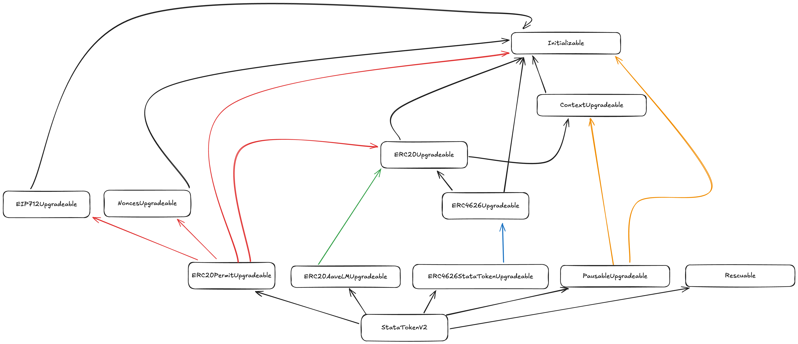

# stataToken - Static aToken vault/wrapper

## About

The StataToken in an [EIP-4626](https://eips.ethereum.org/EIPS/eip-4626) generic token vault/wrapper intended to be used with aave v3 aTokens.

## Features

- **Full [EIP-4626](https://eips.ethereum.org/EIPS/eip-4626) compatibility.**
- **Accounting for any potential liquidity mining rewards.** Let’s say some team of the Aave ecosystem (or the Aave community itself) decides to incentivize deposits of USDC on Aave v3 Ethereum. By holding `stataUSDC`, the user will still be eligible for those incentives.
  It is important to highlight that while currently the wrapper supports infinite reward tokens by design (e.g. AAVE incentivizing stETH & Lido incentivizing stETH as well), each reward needs to be permissionlessly registered which bears some [⁽¹⁾](#limitations).
- **Upgradable by the Aave governance.** Similar to other contracts of the Aave ecosystem, the Level 1 executor (short executor) will be able to add new features to the deployed instances of the `StataTokens`.
- **Powered by a StataTokenFactory.** Whenever a token will be listed on Aave v3, anybody will be able to call the StataTokenFactory to deploy an instance for the new asset, permissionless, but still assuring the code used and permissions are properly configured without any extra headache.

See [IStata4626LM.sol](./interfaces/IERC20AaveLM.sol) for detailed method documentation.

## Deployed Addresses

The StataTokenFactory is deployed for all major Aave v3 pools.
An up to date address can be fetched from the respective [address-book pool library](https://search.onaave.com/?q=stata%20factory).

## Limitations

The `stataToken` is not natively integrated into the aave protocol and therefore cannot hook into the emissionManager.
This means a `reward` added **after** `statToken` creation needs to be registered manually on the token via the permissionless `refreshRewardTokens()` method.
As this process is not currently automated users might be missing out on rewards until the method is called.

## Security procedures

For this project, the security procedures applied/being finished are:

- The test suite of the codebase itself.
- Certora audit/property checking for all the dynamics of the `stataToken`, including respecting all the specs of [EIP-4626](https://eips.ethereum.org/EIPS/eip-4626).

---

## Upgrade Notes StataTokenV2

### Inheritance

The `StaticATokenLM`(v1) was based on solmate.
To allow more flexibility the new `StataTokenV2`(v2) is based on [openzeppelin-contracts-upgradeable](https://github.com/OpenZeppelin/openzeppelin-contracts-upgradeable) which relies on [`ERC-7201`](https://eips.ethereum.org/EIPS/eip-7201) which isolates storage per contract.

The implementation is separated in two ERC20 extensions and one actual "merger" contract stitching functionality together.

1. `ERC20AaveLM` is an abstract contract implementing the forwarding of liquidity mining from an underlying AaveERC20 - an ERC20 implementing `scaled` functions - to holders of a wrapper contract.
   The abstract contract is following `ERC-7201` and acts as erc20 extension.
2. `ERC4626StataToken` is an abstract contract implementing the [EIP-4626](https://eips.ethereum.org/EIPS/eip-4626) methods for an underlying aToken.
   The abstract contract is following `ERC-7201` and acts as erc20 extension.
   The extension considers pool limitations like pausing, caps and available liquidity.
   In addition it adds a `latestAnswer` priceFeed, which returns the share price based on how aave prices the underlying.
3. `StataTokenV2` is the main contract inheriting `ERC20AaveLM` and `ERC4626StataToken`, while also adding `Pausability`, `Rescuability`, `Permit` and the actual initialization.

### Libraries

The previous `StaticATokenLM` relied on `WadRayMath` and `WadRayMathExplicitRounding` - a custom version where one can specify the rounding behavior - for math operations.
To align the system with the other open zeppelin contracts, all usage has been replaced by the [openzeppelin math](https://github.com/OpenZeppelin/openzeppelin-contracts/blob/master/contracts/utils/math/Math.sol) library.

### MetaTransactions

MetaTransactions have been removed as there was no clear use-case besides permit based deposits ever used.
To account for that specific use-case a dedicated `depositWithPermit` was added.

### Direct AToken Interaction

In v1 deposit was overleaded to allow underlying & aToken deposits.
While this approach was fine it seemed unclean and caused some confusion with integrators.
Therefore v2 introduces dedicated `depositATokens` and `redeemATokens` methods.

#### Rescuable

[Rescuable](https://github.com/bgd-labs/solidity-utils/blob/main/src/contracts/utils/Rescuable.sol) has been applied to
the `StataTokenV2` which will allow the aclAdmin to rescue surplus tokens on the contract to the treasury.

#### Pausability

The `StataTokenV2` implements the [PausableUpgradeable](https://github.com/OpenZeppelin/openzeppelin-contracts-upgradeable/blob/9a47a37c4b8ce2ac465e8656f31d32ac6fe26eaa/contracts/utils/PausableUpgradeable.sol) allowing any emergency admin to pause the vault in case of an emergency.
As long as the vault is paused, minting, burning, transfers and claiming of rewards is impossible.

#### LatestAnswer

While there are already mechanisms to price the `StataTokenV2` implemented by 3th parties for improved UX/DX the `StataTokenV2` now exposes `latestAnswer`.
`latestAnswer` returns the asset price priced as `underlying_price * exchangeRate`.
It is important to note that:

- `underlying_price` is fetched from the Oracle, which means it is subject to mechanisms implemented by the DAO on top of the Chainlink price feeds.
- the `latestAnswer` is a scaled response returning the price in the same denomination as `underlying_price` which means the sprice can be undervalued by up to 1 wei
- while this should be obvious deviations in the price - even when limited to 1 wei per share - will compound per full share

### Security considerations

- the code was extensively tested with both unit & fuzzing tests
- [Certora security review and property checking](https://github.com/aave-dao/aave-v3-origin/blob/067d29eb75115179501edc4316d125d9773f7928/audits/11-09-2024_Certora_StataTokenV2.pdf)
